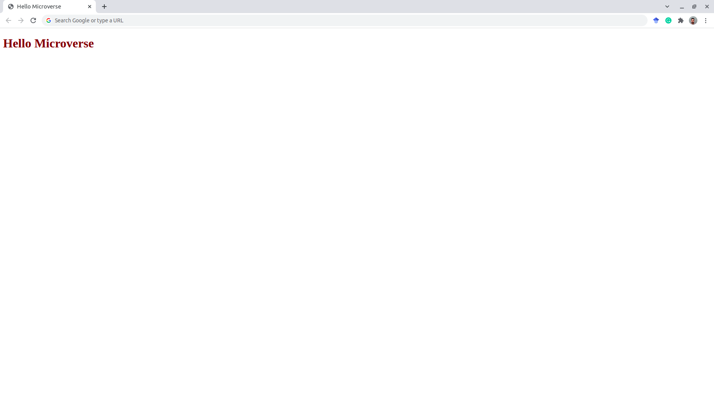

# Hello Microverse

> This is my frist project at Microverse.

In this project, the main objective was to apply our git/GitHub knowledge learned and start getting familiar with this environment.
I could also apply the lessons about how to write code professionally and get familiar with GitHub Actions and Linters.

## Built With

- HTML
- CSS

## Author

👤 **Leonardo Pires Goss**

- GitHub: [@leopiresgoss](https://github.com/leopiresgoss)
- Twitter: [@leopiresgoss](https://twitter.com/leonardopgoss)
- [LinkedIn](https://www.linkedin.com/in/leonardogoss/)

## 🤝 Contributing

Contributions, issues, and feature requests are welcome!

Feel free to check the [issues page](../../issues/).

## Show your support

Give a ⭐️ if you like this project!

## Acknowledgments

- A special thank for @fernandorpm for this amazing [README template](https://github.com/microverseinc/readme-template)

## 📝 License

This project is [MIT](./MIT.md) licensed.
